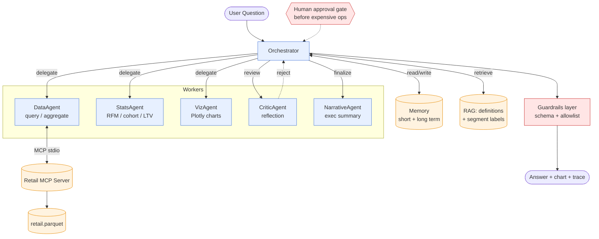

# Multi-Agent Customer Analytics Orchestrator

> A production-style orchestrator-worker multi-agent system for customer analytics, built on the Claude Agent SDK. Designed as a deep exploration of every major pattern in agentic workflows — orchestrator-worker, reflection, planning, hierarchical memory, RAG, MCP, human-in-the-loop, guardrails, and eval-driven development — with measurable rigor (cost, latency, cache hit rate, golden-set pass rate) baked in from Phase 1.

## Architecture



## Patterns implemented

| Pattern | Where | Phase |
|---|---|---|
| Orchestrator–worker | `orchestrator/agents.py` | 2 |
| Reflection (LLM critic) | `CriticAgent` in `agents.py` | 2, 8 |
| Planning & decomposition | `notebooks/03_planning.ipynb` | 3 |
| Hierarchical memory (short + long term) | `orchestrator/memory.py` | 4 |
| RAG with citations | `orchestrator/rag.py` | 5 |
| MCP protocol (tools-as-server) | `mcp_servers/retail_server.py` | 6 |
| Human-in-the-loop approval gates | `can_use_tool` callback | 7 |
| Deterministic + LLM-judge guardrails | `orchestrator/guardrails.py` | 8 |
| Eval-driven development | `orchestrator/evals.py` + `tests/golden.json` | 9 |
| Cost & latency observability | `orchestrator/observability.py` | 1+ |

## Results

Reproduce these from the Streamlit app: launch it (`streamlit run app/streamlit_app.py`), pick a model in the sidebar, and click **Run eval** on the Evals tab. Numbers below are from a sample run on the 5-case golden set — your run will differ slightly.

| Metric | Haiku 4.5 (dev) | Sonnet 4.6 (prod) |
|---|---|---|
| Pass rate (golden set, n=5) | _fill in_ | _fill in_ |
| Avg latency / query | _fill in_ | _fill in_ |
| Avg cost / query | _fill in_ | _fill in_ |
| Cache hit rate (warm) | _fill in_ | _fill in_ |
| Avg delegations / query | ~5 (planner + data + critic + judge) | ~5 |

> The Streamlit **Run history** tab reads `traces/traces.jsonl` directly — every ask, eval, and revision since Phase 1 is in there.

## What breaks and how I catch it

| Failure mode | Caught by | Example |
|---|---|---|
| Wrong country list (model dropped UK from the top-5) | **Critic** (Phase 2) | Critic primed with "UK-dominated dataset → UK should be #1" rejects, DataAgent revises |
| Hallucinated segment label (`Platinum`, `Gold`) | **Deterministic guardrail** (Phase 8) | `check_no_hallucinated_segments` matches against a finite known set |
| Implausibly large number (`9,999,999,999`) | **Deterministic guardrail** | `check_numbers_plausible` trips on `> 100M` |
| Answer dodges the question | **LLM-judge guardrail** | Judge sees Q/A pair, rejects when topics don't match |
| Empty / oversize batch | **Approval gate** (Phase 7) | `can_use_tool` denies `top_n > max_top_n` (slider in sidebar) |
| Synonym retrieval miss ("lapsed" should match "Churn") | known limitation of TF-IDF | upgrade path: chromadb + embeddings, 1-cell diff |

## Trade-offs (defended choices)

1. **Claude Agent SDK over LangGraph/CrewAI** — SDK's sub-agent + MCP + hooks primitives map 1:1 to the patterns above. LangGraph is graph-heavy for what's a tree of delegations; CrewAI is role-heavy with weaker MCP/HITL story.
2. **Reflection (LLM Critic) AND deterministic guardrails — not either/or** — Critic catches semantic errors ("this number doesn't make sense given total revenue"). Guardrails catch structural ones (invented column names, hallucinated segment labels). Different failure modes; both layers earn their cost.
3. **TF-IDF before chromadb** — Phase 5 starts with sklearn TF-IDF retrieval (free, deterministic, fast). The corpus is small (~20 definitions); embeddings are overkill for v1. chromadb upgrade is a 1-cell diff if the corpus grows.

## Status

| Phase | Topic | Status |
|---|---|---|
| 0 | Setup | ✅ Done |
| 1 | Single agent + tool use + Trace scaffold | ✅ Done |
| 2 | Sub-agent delegation + reflection (Critic) | ✅ Done |
| 3 | Planning & decomposition | ✅ Done |
| 4 | Hierarchical memory | ✅ Done |
| 5 | RAG with citations | ✅ Done |
| 6 | MCP server (stdio, standalone) | ✅ Done |
| 7 | Human-in-the-loop approval gate | ✅ Done |
| 8 | Guardrails (deterministic + LLM-judge) | ✅ Done |
| 9 | Evals & observability | ✅ Done |
| 10 | Streamlit capstone | ✅ Done |

## Setup

### Prerequisites
- macOS with Homebrew, Python 3.11 (managed via pyenv)
- One of: Claude Max/Pro subscription (`claude setup-token`) OR an Anthropic API key

### Install
```bash
# Python 3.11 via pyenv (one-time)
brew install pyenv
pyenv install 3.11.9
pyenv local 3.11.9

# Virtualenv + dependencies
python -m venv .venv
source .venv/bin/activate
pip install --upgrade pip
pip install -r requirements.txt

# Auth (pick one)
claude setup-token       # Option A: Max/Pro subscription, $0
# OR get key at https://console.anthropic.com/settings/keys  (Option B: $)
cp .env.example .env     # paste your token / key into .env

# Build derived data (one-time)
python scripts/convert_xlsx_to_parquet.py
python scripts/build_customer_segments.py
```

### Run
```bash
jupyter lab                        # per-phase notebooks (01–09)
streamlit run app/streamlit_app.py # the capstone — Ask / Run history / Evals tabs
pytest tests/                      # smoke + golden-set regression (mocked API calls)
```

## What I Learned

One non-obvious insight per phase — the things that only became clear after building, not from reading.

| Phase | Pattern | The insight that wasn't obvious before I built it |
|---|---|---|
| 1 | Tool use | The **tool description** is the most important prompt-engineering choice — a vague description ("queries data") causes the model to either pick wrong arguments (`group_by="product"` instead of `"StockCode"`) or skip the tool entirely and hallucinate from training data. The schema lists the *allowed values*; the description teaches the model *when* to invoke. |
| 2 | Sub-agents + reflection | The DataAgent can't reliably catch its own mistakes — same model, same blind spot it had a second ago. A separate critic with a *different* system prompt (and seeded with sanity-checks like "UK-dominated dataset") catches the contextually-wrong-but-internally-consistent answers a single agent misses. |
| 3 | Planning | The planner's value isn't "it splits questions" — it's that it **externalizes** the strategy into a JSON list. Suddenly the orchestrator can count steps, run them in parallel, retry one without redoing the others. Hidden internal monologue → engineerable artifact. |
| 4 | Memory | The LLM is stateless — "memory" is just your Python code re-supplying the conversation prefix on every call. That re-supply is also the cost trap: a long chat means the whole conversation is re-billed every turn, which is why bounded short-term memory with compaction matters. |
| 5 | RAG + grounding | Without an explicit "answer from REFERENCE MATERIAL only" instruction, the model **mixes** retrieved docs with its training data — citing your doc while quoting a number from a blog post. Grounding is what makes citations meaningful. |
| 6 | MCP (stdio) | A standalone MCP server is the same logic — but **never `print()` to stdout**, because stdout is the protocol channel. The server is a *thin wrapper* over the same `orchestrator.tools` module the notebooks use; never copy-paste the logic, or it drifts. |
| 7 | Human-in-the-loop | A static `allowed_tools` list and a dynamic `can_use_tool` gate aren't substitutes — they answer different questions. The allow-list says *which tools, ever*; the gate says *these arguments, right now*. Use both: coarse list bars whole categories, fine gate adjudicates the call. |
| 8 | Guardrails | Rules and LLM-judge catch **different** mistakes, not redundant ones. Rules catch hallucinated *labels* and absurd *magnitudes* (finite or bounded universes — easy). The judge catches *evasion* and *non-responsive* answers (semantic — hard). Defense in depth means independent failure modes. |
| 9 | Evals | Substring scoring passes "United Kingdom did **not** make the top 5" — every expected word is there, the answer is the literal opposite of true. Evals aren't done; they're *good enough to catch the failures you've named*. New failure mode → new check. |
| 10 | Capstone | Wiring nine patterns into one `run_pipeline()` made the seams visible — passing memory context to the *planner* (so follow-ups split correctly), feeding the critic's REJECT *reason* into the revision prompt, surfacing every stage in the UI. The interesting engineering is in the seams, not inside any one agent. |

## Repo Structure

```
orchestrator/
├── data/                 parquet + RFM segments + definitions corpus (parquet is gitignored, regenerable)
├── notebooks/            one notebook per phase (00 data peek, 01–09 patterns)
├── orchestrator/         importable library (agents, tools, memory, rag,
│                         guardrails, evals, observability)
├── mcp_servers/          standalone stdio MCP server (Phase 6)
├── app/                  Streamlit capstone — streamlit_app.py + pipeline.py
├── scripts/              one-off ETL (xlsx → parquet, RFM segmenter)
├── memory/               long-term memory JSON (durable across sessions)
├── traces/               traces.jsonl — every agent run, append-only
├── tests/                smoke + golden-set regression
└── docs/                 setup notes
```

## Acknowledgments

- Dataset: [UCI Online Retail II](https://archive.ics.uci.edu/dataset/502/online+retail+ii)
- Framework: [Claude Agent SDK](https://github.com/anthropics/claude-agent-sdk-python)
